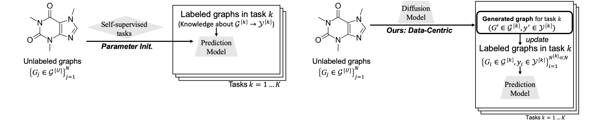
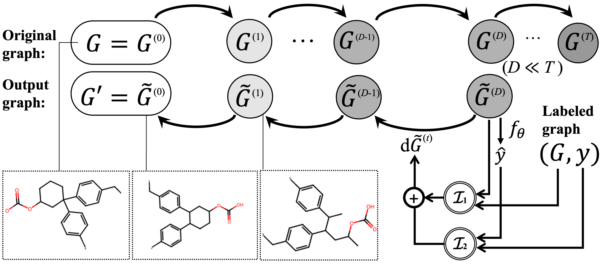

Data-Centric Learning from Unlabeled Graphs with Diffusion Model
================================================================

This is the code for DCT, a data-centric transfer learning framework with diffusion model on graphs. This data-centric approach avoids the inappropriate designs of hand-crafted self-supervised tasks and transfer knowledge by data augmentation. Please refer to our paper (accepted by NeurIPS 2023): https://arxiv.org/abs/2303.10108 for more details.



## Requirements

This code was developed and tested with Python 3.7.12, PyTorch 1.13.0, and PyG 2.1.0.
All dependencies are specified in the `requirements.txt` file.

## Usage

### Learning from unlabeled graphs

We do not include the code to learn from the unlabeled graphs. The diffusion model could be any pre-trained diffusion based graph generator. We provide a well-trained model in the path: `checkpoints/qm9_denoise.pth`. If readers want to train the diffusion model from the scratch, we suggest following the codes from [GDSS](https://github.com/harryjo97/GDSS). Our code should be compatible with any continuous-state graph diffusion model trained on QM9 dataset. For the graph diffusion model trained on other datasets (e.g., ZINC-250K), modifications for the `enbale_index` variable in the  `convert_sparse_to_dense `function from the `utils.mol_utils.py` are needed.

### Generating task-specific labeled graphs



Following is an example command to run experiments on molecules' and polymers' classification and regression datasets.

```
# OGBG-SIDER
python main.py --dataset ogbg-molsider
```

The dataset name can be any of `['plym-density', 'plym-oxygen','plym-melting', 'plym-glass', 'ogbg-mollipo', 'ogbg-molfreesolv', 'ogbg-molesol', 'ogbg-molhiv', 'ogbg-molbace', 'ogbg-molbbbp', 'ogbg-molclintox','ogbg-molsider','ogbg-moltox21','ogbg-moltoxcast']`

We use `n_jobs=22` by default to covnert the generated molecules to the PyG-style data objectives with 22 processes. Please adjust this hyper-parameter in accordance with the available CPU cores.

## Citation

If you find this repository useful, please cite our paper:

```
@article{liu2023data,
  title={Data-Centric Learning from Unlabeled Graphs with Diffusion Model},
  author={Liu, Gang and Inae, Eric and Zhao, Tong and Xu, Jiaxin and Luo, Tengfei and Jiang, Meng},
  journal={arXiv preprint arXiv:2303.10108},
  year={2023}
}
```
